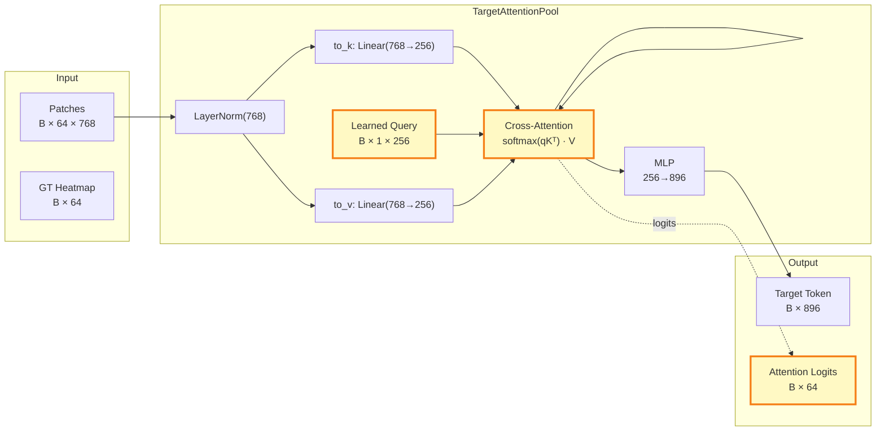

## Architecture Diagram

```mermaid
graph TB
    subgraph INPUTS["Input Data"]
        INST["Task Instruction<br/>natural language"]
        AGENT["Agentview CLS<br/>DINOv2 768-d"]
        PATCHES["Agentview Patches<br/>8×8 grid × 768-d"]
        WRIST["Wrist CLS<br/>DINOv2 768-d"]
        PROPRIO["Proprioception<br/>8-d"]
    end

    subgraph EMBED["Projection Layers"]
        VP["VisionProj<br/>768→896"]
        PE["ProprioEmbed<br/>8→896"]
        TP["TargetAttentionPool<br/>1 query cross-attn
over 64 patches
→ token + logits"]
    end

    subgraph TOKENS["Token Sequence (current frame)"]
        T1["V_agent<br/>896-d"]
        T2["V_target<br/>896-d"]
        T3["V_wrist<br/>896-d"]
        T4["V_proprio<br/>896-d"]
    end

    subgraph LLM["Qwen2-0.5B + LoRA (Frozen Backbone)"]
        L1["Language Tokens"]
        L2["BOS"]
        L3["Future Frame Triplets
V_agent_{t+k} V_wrist_{t+k} ACT_k
for k = 1..K"]
        L4["EOS"]
    end

    subgraph OUTPUTS["Heads"]
        VH["VisionHead<br/>896→768"]
        AH["ActionHead<br/>896→7"]
    end

    subgraph LOSSES["Loss Functions"]
        VL["Vision Loss<br/>Cosine Similarity"]
        AL["Action Loss<br/>L1 on delta pose"]
        GL["Gripper Loss<br/>BCE"]
        TL["Target Loss<br/>Cross-Entropy
attn ↔ GT heatmap"]
    end

    %% Connections
    INST --> L1
    AGENT --> VP
    WRIST --> VP
    PATCHES --> TP
    PROPRIO --> PE

    VP --> T1
    VP --> T3
    PE --> T4
    TP --> T2
    TP -. "attention logits" .-> TL

    T1 & T2 & T3 & T4 & L1 & L2 & L3 & L4 --> LLM

    LLM --> VH
    LLM --> AH

    VH --> VL
    AH --> AL
    AH --> GL

    %% Styling
    classDef input fill:#e3f2fd,stroke:#1565c0,stroke-width:2px
    classDef embed fill:#fff3e0,stroke:#e65100,stroke-width:2px
    classDef llm fill:#e8f5e9,stroke:#2e7d32,stroke-width:2px
    classDef output fill:#fce4ec,stroke:#c62828,stroke-width:2px
    classDef loss fill:#f3e5f5,stroke:#6a1b9a,stroke-width:2px
    classDef highlight fill:#fff9c4,stroke:#f57f17,stroke-width:3px

    class INPUTS,AGENT,WRIST,PATCHES,PROPRIO,INST input
    class VP,PE,TP embed
    class T1,T2,T3,T4 tokens
    class LLM,llm
    class VH,AH output
    class VL,AL,GL,TL loss
    class TP,T2 highlight
```

**Legend:**
- 🔵 Blue = Input data (pre-extracted DINOv2 features + language)
- 🟠 Orange = Projection / embedding layers (trainable)
- 🟡 Yellow (highlighted) = **TargetAttentionPool** — the key novelty: 1 learned query over 8×8 patch grid, producing a task-focused target token
- 🟢 Green = LLM backbone (Qwen2-0.5B, frozen + LoRA)
- 🔴 Red = Prediction heads (vision + action)
- 🟣 Purple = Loss functions (4 terms, including the supervised target loss)

---

## TargetAttentionPool Detail



**Key insight:** The attention logits over the 64 patches are supervised via cross-entropy toward the GT heatmap (derived from instance segmentation). At inference time, the target token is produced purely by the learned attention — no GT needed.
